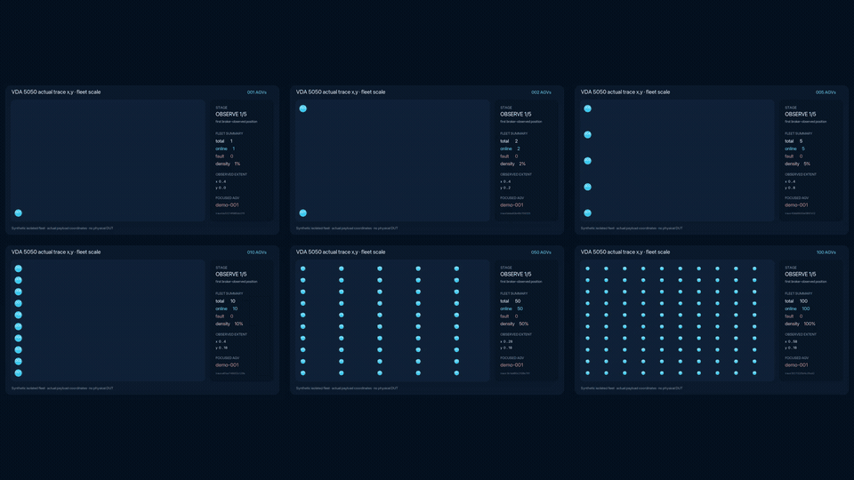

# vda5050-lab

[](https://github.com/ekusiadadus/vda5050-lab/actions/workflows/ci.yml)
[](https://github.com/ekusiadadus/vda5050-lab/releases)
[](LICENSE)

vda5050-lab is the home of **vda5050-doctor**, an offline incident-diagnosis
CLI for VDA 5050 traces.

Give it MQTT observations from a stalled or misbehaving integration. It should
explain, in less than ten minutes of user time:

1. what was observed;
2. which messages support that explanation;
3. which VDA 5050 version and clause are relevant;
4. what cannot be concluded from the capture;
5. which logs or observations to collect next; and
6. whether the next investigation should start with the mobile robot, fleet
   control, transport, or remain unresolved.

The product does not assign blame when the evidence cannot prove the responsible
protocol role.

## Status

[`v0.2.0` Synthetic Demo Preview](https://github.com/ekusiadadus/vda5050-lab/releases/tag/v0.2.0)
is the current Developer Preview. This is an offline diagnostic implementation
plus a bounded synthetic demonstration, not a public-alpha or certification
claim.

The Rust workspace now contains the bounded importer, evidence model,
versioned order comparator, eight initial rule IDs across five incident
families, terminal/JSON reporting, synthetic fixtures, and pinned CI. Local
formatting, strict Clippy, locked tests, coverage, and RustSec audit pass.

Product usefulness is still unproven: no real customer trace, design-partner
pilot, external DUT, customer broker, or hardware execution has been
validated. The Doctor deliberately accepts only VDA 5050 3.0.0 until a
separate 2.1 rule profile and source bundle exist. A separate Tier 1 demo can
exercise virtual actors against a disposable local broker, but its same-job
synthetic evidence is not production proof.

## Why this project

VDA 5050 failures are commonly behavioral rather than syntactic. A message may
match its JSON Schema while the integration still mishandles an order update,
base/horizon transition, reconnect, cancel, or action lifecycle.

Existing products already make MQTT traffic easier to observe:

- [arculus describes](https://www.arculus.de/a-look-into-vda5050) the manual
  log-analysis workflow and its own visualizer and compliance-test suite.
- [Fletr](https://fletr.io/documentation) provides VDA-oriented MQTT
  monitoring, log import, timelines, and multi-version support.

This project is therefore not differentiated by being another viewer. Its
initial product boundary is evidence-bounded diagnosis:

> Fletr and similar tools help engineers inspect traffic. vda5050-doctor
> explains what the available traffic does and does not support, and recommends
> the next investigation step.

Reported implementation failures also show why a single-message validator is
insufficient:

- repeated newBaseRequest handling
  ([coatyio/vda-5050-lib.js#44](https://github.com/coatyio/vda-5050-lib.js/issues/44));
- connection state after reconnect
  ([#38](https://github.com/coatyio/vda-5050-lib.js/issues/38)); and
- cancel/action callback transitions
  ([#33](https://github.com/coatyio/vda-5050-lib.js/issues/33)).

Specification ambiguity remains visible rather than being converted into a
made-up universal answer. For example, the meaning of omitted theta has
produced an interoperability discussion between implementations
([VDA5050#613](https://github.com/VDA5050/VDA5050/issues/613)).

## First user

The first user is a system integrator or robot protocol engineer commissioning
a mixed-vendor VDA 5050 system. The first job is not certification. It is:

> Explain why this order stopped, and tell me what evidence to obtain next.

Operations dashboards, generic MQTT exploration, active conformance testing,
and physical robot testing are later or separate products.

## Initial product

The first executable is:

~~~text
vda5050-doctor diagnose trace.jsonl --vda-version 3.0.0
~~~

The local prototype accepts explicitly selected local trace formats only and
emits:

- a bounded terminal report;
- canonical JSON;
- incident hypotheses with confidence and evidence IDs;
- applicable specification sources;
- missing-evidence requirements; and
- a next-investigation target:
  MOBILE_ROBOT, FLEET_CONTROL, TRANSPORT, or UNRESOLVED.

The initial vertical slice covers five incident families:

1. repeated order IDs/update IDs with identical or changed semantic content;
2. base, horizon, and stitching inconsistencies;
3. newBaseRequest that remains unhandled;
4. connection state that remains inconsistent after reconnect; and
5. cancel and action lifecycle inconsistencies.

The future public alpha may expand to ten to fifteen evidence-backed diagnoses
and explicit VDA 5050 2.1-to-3.0 migration diagnostics only after the private
pilot gate passes.

## Install, verify, and run

The Developer Preview prerelease provides archives for Linux x86-64/Arm64,
macOS Arm64, and Windows x86-64, a CycloneDX SBOM, twelve per-scale demo media
files, two fleet-overview media files, and the checksum file. Download all
twenty assets, verify the nineteen checksummed payloads, and then verify both
attestations for the archive you will run:

```sh
gh release download v0.2.0 --repo ekusiadadus/vda5050-lab --dir vda5050-doctor-v0.2.0
cd vda5050-doctor-v0.2.0
sha256sum --check SHA256SUMS  # Linux; on macOS: shasum -a 256 --check SHA256SUMS
source_digest="$(git ls-remote https://github.com/ekusiadadus/vda5050-lab.git 'refs/tags/v0.2.0^{}' | cut -f1)"
test "${#source_digest}" -eq 40
archive="vda5050-doctor-v0.2.0-x86_64-unknown-linux-gnu.tar.gz"
gh attestation verify "$archive" \
  --repo ekusiadadus/vda5050-lab \
  --signer-workflow ekusiadadus/vda5050-lab/.github/workflows/release.yml \
  --signer-digest "$source_digest" \
  --source-ref refs/tags/v0.2.0 \
  --source-digest "$source_digest" \
  --deny-self-hosted-runners
gh attestation verify "$archive" \
  --repo ekusiadadus/vda5050-lab \
  --signer-workflow ekusiadadus/vda5050-lab/.github/workflows/release.yml \
  --signer-digest "$source_digest" \
  --source-ref refs/tags/v0.2.0 \
  --source-digest "$source_digest" \
  --deny-self-hosted-runners \
  --predicate-type https://cyclonedx.org/bom
```

Each archive contains the binary, license, changelog, rule catalog, source
manifests, and provenance documentation. The prerelease also includes a
CycloneDX 1.5 SBOM.

To build from source:

Prerequisites: Rust 1.97.1 through `rustup` and a local trace that you are
authorized to inspect.

```sh
make ci
make diagnose-example
```

Run against newline-delimited message envelopes:

```sh
cargo run --locked --bin vda5050-doctor -- \
  diagnose trace.jsonl \
  --vda-version 3.0.0 \
  --input-format envelope-jsonl \
  --format terminal
```

Supported input-format values are `canonical-jsonl`, `envelope-jsonl`, and
`envelope-array`. Output is `terminal` or deterministic `json`. Format
selection is explicit; the importer does not guess. Final-component symlinks,
symlink traversal below trusted bases, devices, URI inputs, duplicate JSON
keys, unsafe nesting, oversized records, and configured limits above compiled
safety ceilings fail closed or remain accounted for as rejected records. The
Developer Preview caps both input files and conservatively accounted retained
record data at 64 MiB; budget exhaustion is explicit in the report and
truncates further record retention.

`make ci` requires separately installed, pinned audit tools:

```sh
cargo install cargo-audit --version 0.22.2 --locked
cargo install cargo-deny --version 0.20.2 --locked
```

Release maintainers also install the Rust `llvm-tools-preview` component,
pinned `cargo-llvm-cov 0.8.7`, and `cargo-cyclonedx 0.5.9`, then run
`make release-check`. The offline Doctor and library gate fails below 80% line
coverage or 80% region coverage. The live demo orchestration is excluded from
that unit-coverage denominator and is instead gated by real Docker/Mosquitto
incident, passive, control, and pre-CONNECT failure tests.

The release scripts also require `jq` plus either GNU `sha1sum` and
`sha256sum`, or the macOS-compatible `shasum` fallback. CI additionally runs
`actionlint` and `shellcheck` against the release workflow and scripts.

```sh
rustup component add llvm-tools-preview --toolchain 1.97.1
cargo install cargo-llvm-cov --version 0.8.7 --locked
cargo install cargo-cyclonedx --version 0.5.9 --locked
make release-check
```

Synthetic examples and expected proof boundaries are documented in
[fixtures/synthetic/README.md](fixtures/synthetic/README.md).

## Isolated Tier 1 multi-robot demo

`vda5050-demo` is a separate, intentionally bounded executable for one
synthetic reconnect scenario at 1 through 100 virtual mobile robots. The
published scale suite is `1, 2, 5, 10, 50, 100`. It connects virtual actors to
a disposable internal broker, records broker-egress observations, and
demonstrates the evidence boundary around a missing `ONLINE` publication after
`CONNECTION_BROKEN`.

Every robot has a distinct VDA `serialNumber`, topic prefix, MQTT ClientId,
order ID, participant identity, and route. `demo-001` is the only fault target;
the remaining robots are non-fault background controls so cross-robot
attribution errors are visible.

[](https://github.com/ekusiadadus/vda5050-lab/releases/download/v0.2.0/vda5050-fleet-overview-v0.2.0.mp4)

Run the recommended internal-network workflow with Docker Compose and `jq`:

```sh
bash scripts/run-tier1-demo.sh
```

Select one published scale or run the complete suite:

```sh
make demo-fleet DEMO_ROBOTS=10
make demo-fleet-e2e
```

The script validates the resolved Compose topology and the runtime Docker
network before MQTT CONNECT, exposes no broker host port, runs Doctor with no
network, verifies the expected D4 result, and tears the stack down.

The XY layout is deterministic. For zero-based robot index `i`,
`column = i / 10` and `row = i % 10`; its start is
`(6 * column, 2 * row)`, released end is `(start.x + 4, start.y)`, and horizon
end is `(start.x + 4, start.y + 1)`. Values are meters in the synthetic
project-specific `warehouse-demo` map. The lower-left origin is a presentation
convention, not a measurement from a real warehouse.

| Count | Purpose | Release media |
| ---: | --- | --- |
| 1 | Original reconnect evidence matrix | [MP4](https://github.com/ekusiadadus/vda5050-lab/releases/download/v0.2.0/vda5050-fleet-001-v0.2.0.mp4) · [GIF](https://github.com/ekusiadadus/vda5050-lab/releases/download/v0.2.0/vda5050-fleet-001-v0.2.0.gif) |
| 2 | Fault/control identity separation | [MP4](https://github.com/ekusiadadus/vda5050-lab/releases/download/v0.2.0/vda5050-fleet-002-v0.2.0.mp4) · [GIF](https://github.com/ekusiadadus/vda5050-lab/releases/download/v0.2.0/vda5050-fleet-002-v0.2.0.gif) |
| 5 | Human-reviewable repeated routes | [MP4](https://github.com/ekusiadadus/vda5050-lab/releases/download/v0.2.0/vda5050-fleet-005-v0.2.0.mp4) · [GIF](https://github.com/ekusiadadus/vda5050-lab/releases/download/v0.2.0/vda5050-fleet-005-v0.2.0.gif) |
| 10 | One complete ten-lane column | [MP4](https://github.com/ekusiadadus/vda5050-lab/releases/download/v0.2.0/vda5050-fleet-010-v0.2.0.mp4) · [GIF](https://github.com/ekusiadadus/vda5050-lab/releases/download/v0.2.0/vda5050-fleet-010-v0.2.0.gif) |
| 50 | Larger bounded trace and manifest | [MP4](https://github.com/ekusiadadus/vda5050-lab/releases/download/v0.2.0/vda5050-fleet-050-v0.2.0.mp4) · [GIF](https://github.com/ekusiadadus/vda5050-lab/releases/download/v0.2.0/vda5050-fleet-050-v0.2.0.gif) |
| 100 | Supported isolated-simulation input ceiling | [MP4](https://github.com/ekusiadadus/vda5050-lab/releases/download/v0.2.0/vda5050-fleet-100-v0.2.0.mp4) · [GIF](https://github.com/ekusiadadus/vda5050-lab/releases/download/v0.2.0/vda5050-fleet-100-v0.2.0.gif) |

The [1920×1080 overview MP4](https://github.com/ekusiadadus/vda5050-lab/releases/download/v0.2.0/vda5050-fleet-overview-v0.2.0.mp4)
and [overview GIF](https://github.com/ekusiadadus/vda5050-lab/releases/download/v0.2.0/vda5050-fleet-overview-v0.2.0.gif)
show all six traces side by side.

The 100-robot run is an isolated synthetic workload. It is not evidence of 100
physical robots, production capacity, real-time performance, vendor
interoperability, collision avoidance, or a fleet-size SLA.

The default fault run produces:

- `run-manifest.json`, with the robot count, coordinate system, resolved routes,
  fault target, broker target, exact identities and topics, and declared
  budgets;
- `trace.canonical.jsonl`, containing the recorded observations; and
- `synthetic-evidence.json`, containing same-job actor, participant, connection
  epoch, completeness, and trace-digest assertions.

The intended comparison is:

| Input to Doctor | `LAB-D4-RECONNECT-STATE` result | What it means |
| --- | --- | --- |
| Fault trace alone | `INCONCLUSIVE`, target `UNRESOLVED` | Passive observations do not prove who reconnected, the connection epoch, or that the relevant topic capture was complete. |
| Same fault trace plus its matching synthetic evidence manifest | `FAIL`, target `MOBILE_ROBOT` | The isolated demo job supplied the otherwise missing assertions. This is synthetic Tier 1 evidence, not production proof. |
| Control trace generated with `--control-online-after-reconnect`, plus its matching manifest | No `LAB-D4-RECONNECT-STATE` finding | The expected `ONLINE` was observed in the synthetic control. Absence of this finding is not PASS, certification, or proof of general conformance. |

See [docs/DEMO.md](docs/DEMO.md) for the broker boundary, exact commands, and
interpretation rules. The design rationale and full coordinate table are in
[ADR 0004](docs/adr/0004-multi-agv-xy-demo.md).

## Result model

Applicability and verdict are separate internal dimensions:

~~~text
applicability = APPLICABLE | NOT_APPLICABLE | UNKNOWN
verdict       = PASS | FAIL | INCONCLUSIVE | UNEVALUATED
~~~

The canonical report retains both values. The human summary maps them to PASS,
FAIL, INCONCLUSIVE, or NOT_APPLICABLE without hiding unknown preconditions.

An incident explanation also distinguishes:

- **observation** — captured bytes, topic, sequence, and capture-local time;
- **assertion** — facts provided by a capture adapter or manifest;
- **inference** — a derived interpretation with its evidence basis; and
- **recommendation** — the next useful investigation action, not a normative
  verdict.

Missing messages, an unknown starting state, incomplete topics, timestamp
ambiguity, or an unsupported capture vantage can force INCONCLUSIVE.

## Product boundaries

The `vda5050-doctor` executable remains offline. It does not:

- connect to an MQTT broker;
- publish a VDA 5050 message;
- control or simulate a robot;
- inject delay, loss, duplication, or reordering;
- diagnose LiDAR, motor, battery, localization, or other physical root causes;
- perform collision avoidance, routing, or traffic management;
- provide official VDA, cybersecurity, or functional-safety certification;
- claim an incomplete passive trace proves that an event never occurred;
- automatically translate a 2.1 deployment into a 3.0 deployment;
- provide a Web UI, JUnit, SARIF, or pseudonymized export; or
- upload customer traces or enable telemetry.

The report references the pinned VDA PDF digest, but the current `diagnose`
command does not yet load and verify a local protocol bundle. Source provenance
and the runtime-compatible manifest are present in
[docs/PROTOCOL_SOURCES.md](docs/PROTOCOL_SOURCES.md); runtime bundle integration
remains a pre-alpha blocker.

The separate `vda5050-demo` executable is the sole current exception to the
active-work boundary: it implements one Tier 1, synthetic, virtual-actor
scenario with at most 100 virtual mobile robots against loopback or an
explicitly asserted isolated service named `broker`. Even at 100, it does not
authorize an external broker, software DUT, customer environment, physical
robot, generic fault bridge, or Tier 2/3 run. Its same-job evidence manifest
cannot be used as production evidence. The retained safety design and remaining
approval boundary live in
[docs/FUTURE_ACTIVE_TESTING.md](docs/FUTURE_ACTIVE_TESTING.md).

## Validation before scale

The project will not call itself useful because its fixtures pass. Before a
public alpha decision it will evaluate at least twenty real incident traces from
at least three organizations, with an organization- or system-level holdout.

The proposed pilot gate requires:

- at least 70% actionable next-step coverage;
- zero observed unsupported participant attribution;
- median time to an accepted next action at most half of the manual baseline;
- correct abstention when evidence is insufficient; and
- at least three teams saying they would use it on another integration.

The complete study contract is in
[docs/VALIDATION_PROTOCOL.md](docs/VALIDATION_PROTOCOL.md).

## Implemented architecture

The Doctor implementation is deliberately small:

- Rust for the offline importer, normalized trace model, diagnostic engine,
  protocol-source handling, reports, and CLI;
- local JSON/JSONL input;
- terminal and canonical JSON output;
- versioned rule contracts and minimized synthetic fixtures; and
- no network-capable dependency in the offline execution path.

The MQTT-capable `vda5050-demo` is a separate workspace binary and dependency
path. Doctor consumes only the local trace and, when explicitly selected, its
matching bounded synthetic evidence manifest; Doctor does not connect to the
demo broker.

See [docs/IMPLEMENTATION_PLAN.md](docs/IMPLEMENTATION_PLAN.md) for the
test-first phases and release gates, [rules/phase1.json](rules/phase1.json) for
the machine-readable rule contract, and
[docs/DEPENDENCIES.md](docs/DEPENDENCIES.md) for the reviewed supply-chain
snapshot.

## Repository contents

~~~text
.
├── .github/workflows/{ci,release}.yml
├── Cargo.lock
├── Cargo.toml
├── CHANGELOG.md
├── CONTRIBUTING.md
├── LICENSE
├── Makefile
├── README.md
├── SECURITY.md
├── apps/vda5050-demo/
├── apps/vda5050-doctor/
├── bundles/manifests/
├── crates/
│   ├── vda5050-core/
│   ├── vda5050-doctor/
│   ├── vda5050-import/
│   ├── vda5050-local-fs/
│   ├── vda5050-protocol/
│   └── vda5050-report/
├── fixtures/synthetic/
├── rules/phase1.json
└── docs/
    ├── adr/
    ├── DEPENDENCIES.md
    ├── DEMO.md
    ├── FUTURE_ACTIVE_TESTING.md
    ├── IMPLEMENTATION_PLAN.md
    ├── PROTOCOL_SOURCES.md
    ├── RELEASING.md
    └── VALIDATION_PROTOCOL.md
~~~

## Primary references

- [VDA 5050 official repository](https://github.com/VDA5050/VDA5050)
- [VDA 5050 version 3.0.0 release](https://github.com/VDA5050/VDA5050/releases/tag/3.0.0)
- [VDA 5050 official documents](https://www.vda.de/en/topics/automotive-industry/vda-5050.)
- [MQTT 3.1.1 specification](https://docs.oasis-open.org/mqtt/mqtt/v3.1.1/mqtt-v3.1.1.html)

## License

Copyright 2026 Daisuke Kuriyama.

Project-authored code and documentation are licensed under Apache License 2.0.
Referenced VDA publications and schemas retain their own copyright and
redistribution terms. Their provenance and license must be reviewed before any
upstream artifact is committed.
